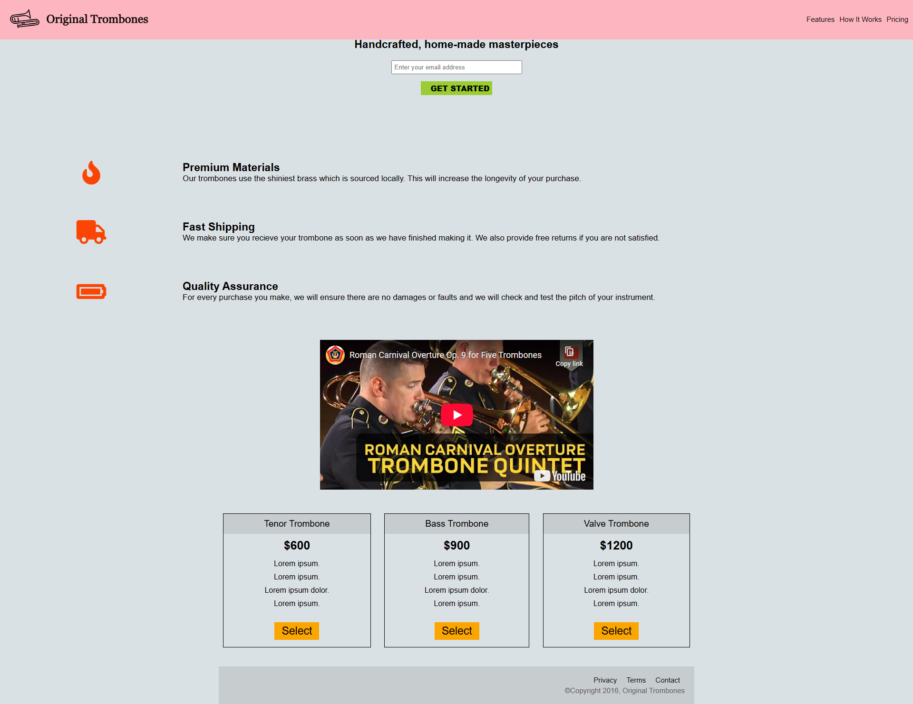

# Product Landing Page

## 📖 Description ##

This is a product landing page created as part of the freeCodeCamp Responsive Web Design certification.  
It simulates a simple marketing page for a fictional product

## 🎯 Objectives ##

- Create a responsive marketing layout
- Use semantic HTML to structure different sections (header, features, pricing, etc.)
- Integrate images, videos, and form elements

## 🛠️ Technologies Used ##

- HTML5
- CSS3

## 🚀 Getting Started ##

To run this project locally:

1. Clone the repository:
   git clone https://github.com/AnouGeek/product-landing-page-freeCodeCamp.git
2. Open the folder and launch the index.html file in your browser.

## 📸 Screenshot ##

## 🪪 License ##

This project is licensed under the MIT License.